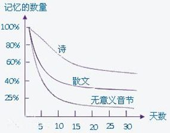

学的东西马上就忘了怎么办？
===

[原贴地址：](https://www.zhihu.com/question/27252044)https://www.zhihu.com/question/27252044

已知办法：复习，不是所有东西都要记住，放慢节奏不急躁
遗忘曲线？

### 方法要素
1. 要清楚读书目的
2. 阅读之前，想一想你知道什么，并且写下来。
3. 提问题
4. 预测（猜测后面的内容）
5. 费曼技巧？？（一句话解决它，用你自己的话概括它。）
6. 可不可以转换成图表
7. 触类旁通

### 读书前问三个问题，写下答案：
1. 关于这个话题，你想起了什么？
2. 关于这个话题，你知道了什么？
3. 你想要知道什么，或者想要学习什么？

### 记忆点：
1. 想象建立联系（越稀奇古怪的，越不符合逻辑的，越容易被大脑记住）
2. 贪多嚼不烂，慢慢来比较好。
3. 触类旁通，和其他学科联系起来，建立联系

### 输出是最好的学习
跟别人讨论，给人讲解。

### 费曼技巧
我们看到，其实费曼技巧，就是学习金字塔理论一个延伸。在学习金字塔理论当中，教授别人带动自己的学习，
是指的真实的教授，而**费曼技巧是在大脑中模拟教授别人，是在做思想实验。**

费曼技巧操作方法:
>* 1、拿张白纸；
* 2、在白纸顶部写上你想理解的概念；
* 3、用你自己的话解释它，就像你在教给别人一样。
* 4、遇到解释不了的地方，就通过查课本、问老师、或到互联网搜寻答案。 
* 5、1-4反复循环
