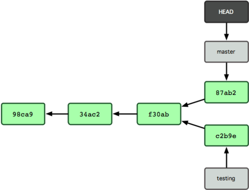

# git 原理理解

### 目录及文件介绍

* HEAD   		指向当前分支
* config		包含了项目特有的配置选项
* description   仅供 GitWeb 程序使用
* hooks/		保存客户端或服务端钩子脚本
* index			保存了暂存区域信息
* info/			目录保存了一份不希望在 .gitignore 文件中管理的忽略模式 (ignored patterns) 的全局可执行文件
* objects/		存储所有数据内容
* refs/			存储指向数据 (分支) 的提交对象的指针


### 对象存储
#### 文件类型
blob: 字符串文件

tree：目录文件

commit：提交文件

#### 文件存储

##### 存储步骤
1. header 以对象类型为起始内容构造一个文件头，然后添加一个空格，接着是数据内容的长度，最后是一个空字节 (null byte)
example:
```ruby
>> header = "blob #{content.length}\0"
=> "blob 16\000"
```

2. Git 将文件头与原始数据内容拼接起来，并计算拼接后的新内容的 SHA-1 校验和。可以在 Ruby 中使用 require 语句导入 SHA1 digest 库，然后调用 Digest::SHA1.hexdigest() 方法计算字符串的 SHA-1 值
```ruby
>> store = header + content
=> "blob 16\000what is up, doc?"
>> require 'digest/sha1'
=> true
>> sha1 = Digest::SHA1.hexdigest(store)
=> "bd9dbf5aae1a3862dd1526723246b20206e5fc37""
```

3. Git 用 zlib 对数据内容进行压缩，在 Ruby 中可以用 zlib 库来实现。首先需要导入该库，然后用 Zlib::Deflate.deflate() 对数据进行压缩
```ruby
>> require 'zlib'
=> true
>> zlib_content = Zlib::Deflate.deflate(store)
=> "x\234K\312\311OR04c(\317H,Q\310,V(-\320QH\311O\266\a\000_\034\a\235"
```

4. 最后将用 zlib 压缩后的内容写入磁盘。需要指定保存对象的路径 (SHA-1 值的头两个字符作为子目录名称，剩余 38 个字符作为文件名保存至该子目录中)。在 Ruby 中，如果子目录不存在可以用 FileUtils.mkdir_p() 函数创建它。接着用 File.open 方法打开文件，并用 write() 方法将之前压缩的内容写入该文件
```ruby
>> path = '.git/objects/' + sha1[0,2] + '/' + sha1[2,38]
=> ".git/objects/bd/9dbf5aae1a3862dd1526723246b20206e5fc37"
>> require 'fileutils'
=> true
>> FileUtils.mkdir_p(File.dirname(path))
=> ".git/objects/bd"
>> File.open(path, 'w') { |f| f.write zlib_content }
=> 32
```
所有的 Git 对象都以这种方式存储，惟一的区别是类型不同 ── 除了字符串 blob，文件头起始内容还可以是 commit 或 tree 。不过虽然 blob 几乎可以是任意内容，commit 和 tree 的数据却是有固定格式的。

##### commit文件格式
<当前文件类型> <当前文件路径>

parent <前一个commit文件的路径>

author <作者> <作者邮箱> <时间戳>

committer <提交者> <提交者者邮箱> <时间戳>


<提交说明注释>

example:
```ruby
tree e562d474522fc61bba990332790d847b2d350720
parent e5d491cb9ca52560355b532f9c06cdc5f245eba3
author GTMYang <289135816@qq.com> 1531797414 +0800
committer GTMYang <289135816@qq.com> 1531797414 +0800

first commit
```

<p style="color: #AD5D0F;font-size: 14px;" >
PS: 可以看出来所有commit文件形成一个链表。<br />
commit里的tree文件包含了本次提交所涉及的文件的快照索引。
</p>


##### tree文件格式

example:
```ruby
040000 tree d8329fc1cc938780ffdd9f94e0d364e0ea74f579      bak
100644 blob fa49b077972391ad58037050f2a75f74e3671e92      new.txt
100644 blob 1f7a7a472abf3dd9643fd615f6da379c4acb3e3a      test.txt
```

### Git 对象打包
git中对每个文件的任何细微的修改都会产生一个新的文件（Git 往磁盘保存对象时默认使用的格式叫松散对象格式），如果大文件多次修改会很浪费存储空间。

Git 时不时地将这些对象打包至一个叫 packfile 的二进制文件以节省空间并提高效率。当仓库中有太多的松散对象，或是手工调用 git gc 命令，或推送至远程服务器时，Git 都会这样做。

**打包后只有最新版本的保存文件全部内容，前面的版本只存储差异信息。**

### Git 中的分支
#### 1 分支本质上仅仅是个指向 commit 对象的可变指针

Git 会使用 master 作为分支的默认名字。在若干次提交后，你其实已经有了一个指向最后一次提交对象的 master 分支，它在每次提交的时候都会自动向前移动。


#### 2 多个分支
> 创建分支命令：
```ruby
 git branch <branch name>
```


#### 3 当前所在分支
Git 保存着一个名为 HEAD 的特别指针。HEAD 指向你正在工作中的本地分支的指针
> 切换分支命令：
```ruby
 git checkout <branch name>
```


切换分支后


#### 4 在工作分支commit




<p style="color: #AD5D0F;font-size: 14px;" >
PS: 由于 Git 中的分支实际上仅是一个包含所指对象校验和（40 个字符长度 SHA-1 字串）的文件，所以创建和销毁一个分支就变得非常廉价。说白了，新建一个分支就是向一个文件写入 41 个字节（外加一个换行符）那么简单，当然也就很快了。
</p>

#### 4 分支合并
> 命令
```ruby
git checkout master // 回到主分支
git merge <branch name>  // 合并分支
git branch -d <branch name> // 删除无用分支
```


> 

### Git 常用命令
```c
git init              // 初始化新仓库
git add <file name>   // 告诉 Git 开始对文件进行跟踪
git add *.c           // git add 通配符方式
git add .             // .表示所有文件（此方式会将不需要跟踪的文件也添加，不建议使用）
git commit -m '提交注释'  //

git clone <仓库路径URL>   // 克隆仓库
git clone <仓库路径URL> <自定义项目目录名> // 克隆仓库（自定义项目目录名）

git status          // 检查文件状态


```


[参考：Git 分支 - 何谓分支](https://git-scm.com/book/zh/v1/Git-%E5%88%86%E6%94%AF-%E4%BD%95%E8%B0%93%E5%88%86%E6%94%AF)

[参考：完整参考文档](https://git-scm.com/book/zh/v1/Git-%E5%86%85%E9%83%A8%E5%8E%9F%E7%90%86)
